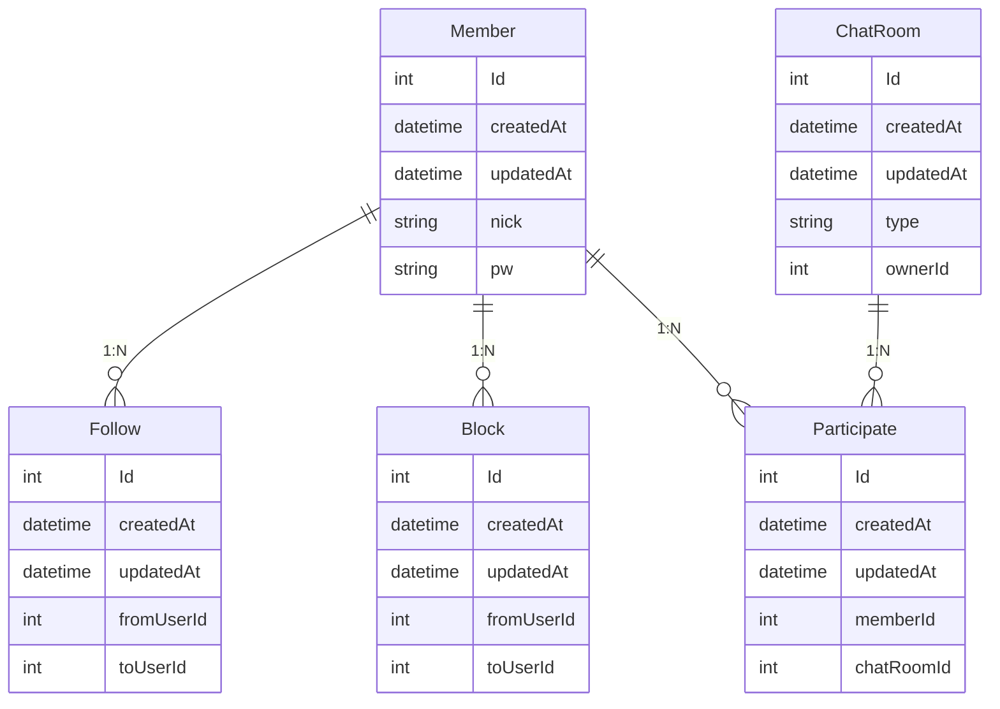

```mermaid
erDiagram
    Member {
        int Id
        datetime createdAt
        datetime updatedAt
        string nick
        string pw
    }

    Follow {
        int Id
        datetime createdAt
        datetime updatedAt
        int fromUserId
        int toUserId
    }

    Block {
        int Id
        datetime createdAt
        datetime updatedAt
        int fromUserId
        int toUserId
    }

    Participate {
        int Id
        datetime createdAt
        datetime updatedAt
        int memberId
        int chatRoomId
    }

    ChatRoom {
        int Id
        datetime createdAt
        datetime updatedAt
        string type
        int ownerId
    }

    Member ||--o{ Follow : "1:N"
    Member ||--o{ Block : "1:N"
    Member ||--o{ Participate : "1:N"
    ChatRoom ||--o{ Participate : "1:N"

```